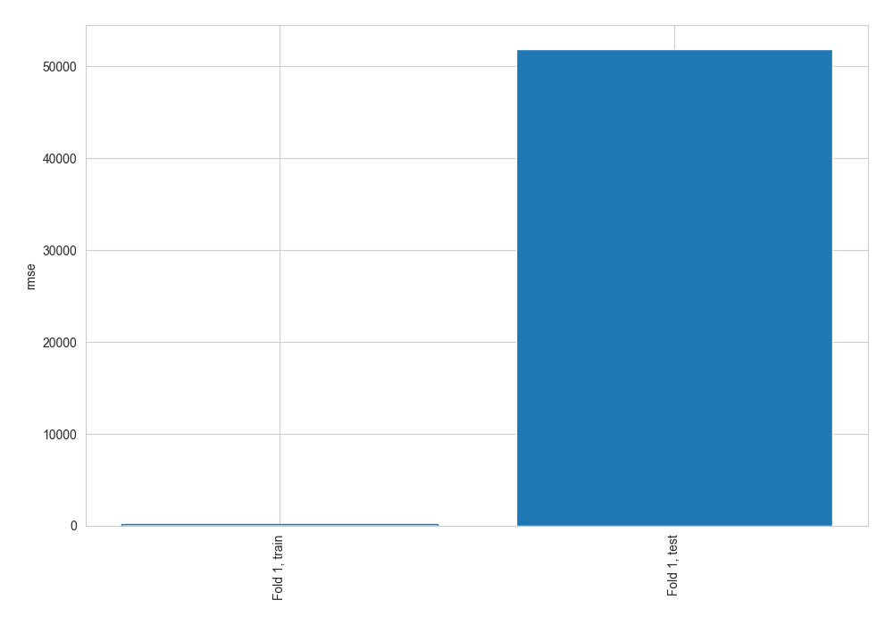
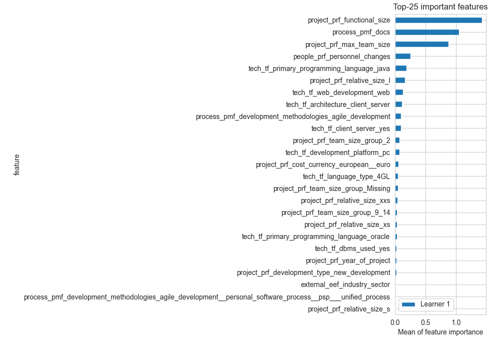
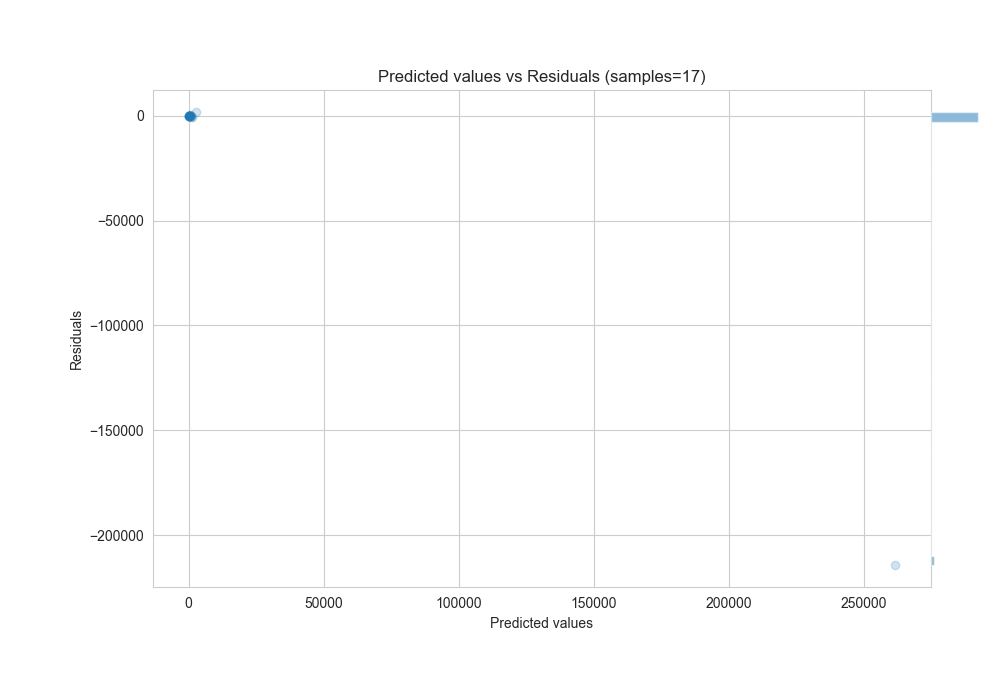
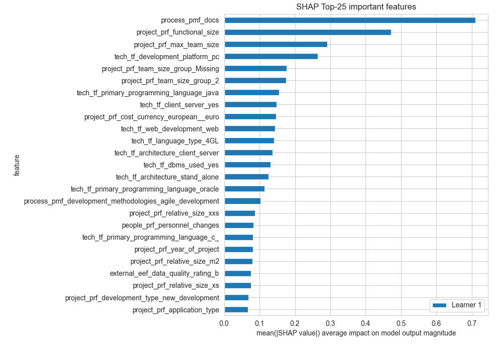
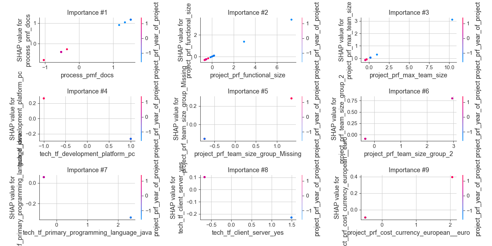
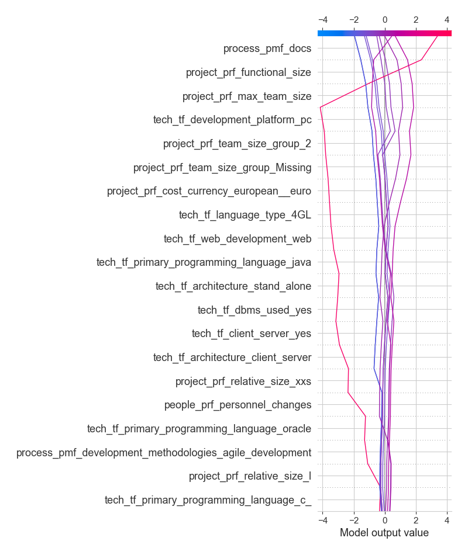

# Summary of 1_Linear

[<< Go back](../README.md)

## Linear Regression (Linear)
- **n_jobs**: -1
- **explain_level**: 2

## Validation
 - **validation_type**: split
 - **train_ratio**: 0.8

## Optimized metric
rmse

## Training time

34.4 seconds

### Metric details:
| Metric   |           Score |
|:---------|----------------:|
| MAE      | 12807.9         |
| MSE      |     2.69736e+09 |
| RMSE     | 51936.1         |
| R2       |   -20.9714      |
| MAPE     |     0.86001     |

## Learning curves

## Coefficients
| feature                                                                                                             |    Learner_1 |
|:--------------------------------------------------------------------------------------------------------------------|-------------:|
| process_pmf_docs                                                                                                    |  0.768247    |
| project_prf_functional_size                                                                                         |  0.463627    |
| project_prf_max_team_size                                                                                           |  0.300153    |
| project_prf_team_size_group_2                                                                                       |  0.271243    |
| project_prf_team_size_group_Missing                                                                                 |  0.208805    |
| project_prf_cost_currency_european__euro                                                                            |  0.191442    |
| tech_tf_language_type_4GL                                                                                           |  0.184151    |
| project_prf_team_size_group_41_50                                                                                   |  0.168595    |
| process_pmf_development_methodologies_agile_development__iterative                                                  |  0.168595    |
| project_prf_application_group_real_time_application                                                                 |  0.167184    |
| tech_tf_dbms_used_yes                                                                                               |  0.150102    |
| project_prf_application_group_mathematically_intensive_application                                                  |  0.148035    |
| process_pmf_development_methodologies_agile_development                                                             |  0.0985468   |
| tech_tf_primary_programming_language_javascript                                                                     |  0.0913002   |
| project_prf_relative_size_xs                                                                                        |  0.0889499   |
| project_prf_year_of_project                                                                                         |  0.0781362   |
| project_prf_team_size_group_9_14                                                                                    |  0.0698729   |
| project_prf_team_size_group_3_4                                                                                     |  0.066567    |
| process_pmf_development_methodologies_agile_development__personal_software_process__psp___unified_process           |  0.0560616   |
| project_prf_cost_currency_canada__dollar                                                                            |  0.0488483   |
| project_prf_relative_size_m1                                                                                        |  0.0458886   |
| project_prf_team_size_group_5_8                                                                                     |  0.0458727   |
| project_prf_relative_size_s                                                                                         |  0.0414842   |
| project_prf_team_size_group_21_30                                                                                   |  0.0413851   |
| process_pmf_development_methodologies_agile_development__unified_process                                            |  0.0388149   |
| tech_tf_development_platform_mr                                                                                     |  0.0388149   |
| process_pmf_development_methodologies_personal_software_process__psp___unified_process                              |  0.0382132   |
| tech_tf_architecture_multi_tier                                                                                     |  0.029546    |
| project_prf_development_type_re_development                                                                         |  0.0225853   |
| process_pmf_development_methodologies_agile_development__scrum                                                      |  0.019274    |
| tech_tf_development_platform_multi                                                                                  |  0.0113221   |
| external_eef_organisation_type                                                                                      |  0.0066621   |
| project_prf_team_size_group_61_70                                                                                   |  0           |
| process_pmf_development_methodologies_agile_development__joint_application_development__jad___multifunctional_teams |  0           |
| intercept                                                                                                           | -2.35428e-15 |
| tech_tf_development_platform_proprietary                                                                            | -0.00150453  |
| tech_tf_primary_programming_language_proprietary_agile_platform                                                     | -0.00150453  |
| tech_tf_language_type_5GL                                                                                           | -0.00150453  |
| tech_tf_architecture_multi_tier_with_web_public_interface                                                           | -0.00649645  |
| tech_tf_primary_programming_language_pl_i                                                                           | -0.00894735  |
| tech_tf_primary_programming_language_c__                                                                            | -0.0106165   |
| tech_tf_server_roles                                                                                                | -0.0169331   |
| external_eef_industry_sector                                                                                        | -0.0196346   |
| project_prf_application_group_business_application                                                                  | -0.0288087   |
| tech_tf_primary_programming_language_abap                                                                           | -0.0298698   |
| people_prf_personnel_changes                                                                                        | -0.0469399   |
| project_prf_application_type                                                                                        | -0.0645391   |
| project_prf_development_type_new_development                                                                        | -0.0743195   |
| external_eef_data_quality_rating_b                                                                                  | -0.0784584   |
| tech_tf_primary_programming_language_c_                                                                             | -0.080332    |
| project_prf_relative_size_l                                                                                         | -0.10084     |
| tech_tf_client_server_no                                                                                            | -0.111753    |
| tech_tf_architecture_stand_alone                                                                                    | -0.120243    |
| tech_tf_tools_used                                                                                                  | -0.123626    |
| project_prf_relative_size_xxs                                                                                       | -0.12657     |
| tech_tf_primary_programming_language_java                                                                           | -0.139201    |
| tech_tf_web_development_web                                                                                         | -0.149387    |
| project_prf_relative_size_m2                                                                                        | -0.151206    |
| tech_tf_client_server_yes                                                                                           | -0.153631    |
| project_prf_application_group_infrastructure_software                                                               | -0.169709    |
| tech_tf_primary_programming_language_oracle                                                                         | -0.176892    |
| tech_tf_architecture_client_server                                                                                  | -0.212359    |
| tech_tf_development_platform_pc                                                                                     | -0.264367    |

## Permutation-based Importance

## True vs Predicted

## Predicted vs Residuals

## SHAP Importance

## SHAP Dependence plots

### Dependence (Fold 1)

## SHAP Decision plots

### Top-10 Worst decisions (Fold 1)

### Top-10 Best decisions (Fold 1)

[<< Go back](../README.md)
