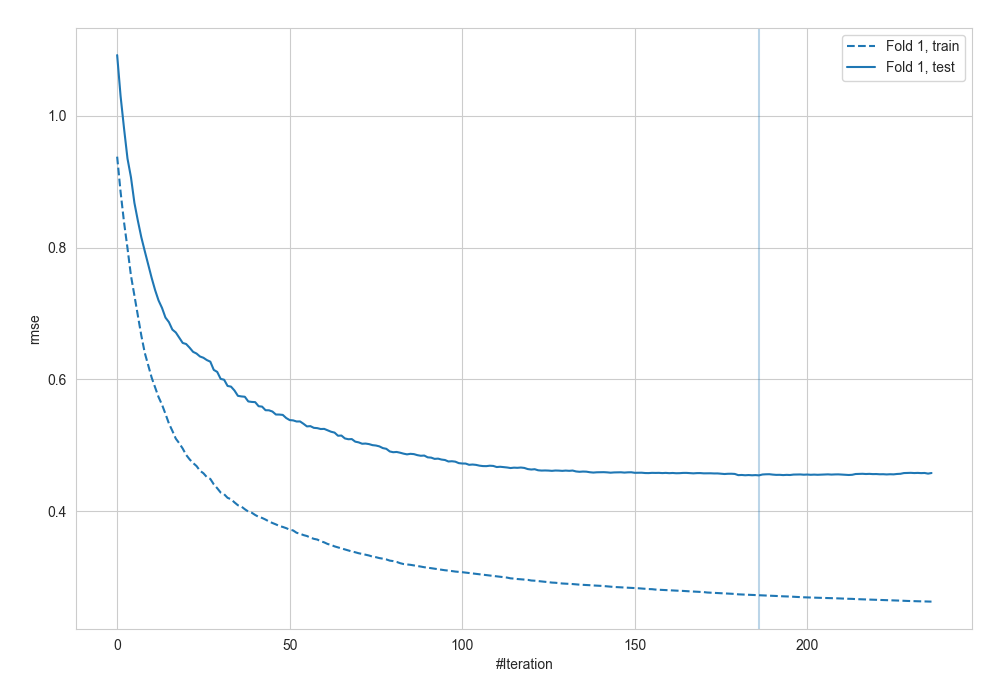
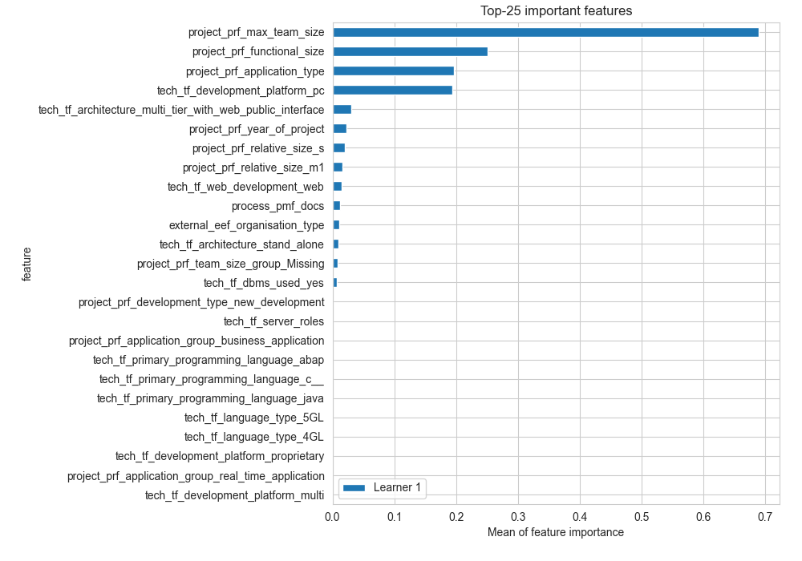
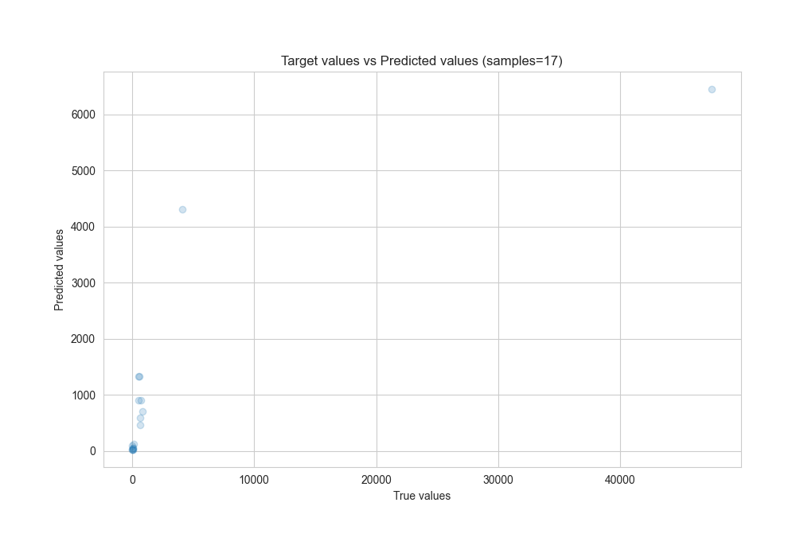
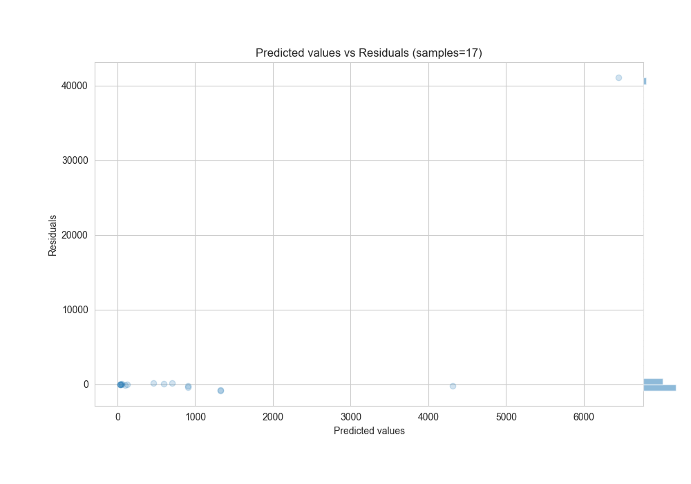

# Summary of 20_LightGBM

[<< Go back](../README.md)

## LightGBM
- **n_jobs**: -1
- **objective**: regression
- **num_leaves**: 31
- **learning_rate**: 0.1
- **feature_fraction**: 1.0
- **bagging_fraction**: 0.5
- **min_data_in_leaf**: 15
- **metric**: rmse
- **custom_eval_metric_name**: None
- **explain_level**: 2

## Validation
 - **validation_type**: split
 - **train_ratio**: 0.8

## Optimized metric
rmse

## Training time

2.7 seconds

### Metric details:
| Metric   |          Score |
|:---------|---------------:|
| MAE      | 2588.95        |
| MSE      |    9.92243e+07 |
| RMSE     | 9961.14        |
| R2       |    0.191767    |
| MAPE     |    0.720564    |

## Learning curves

## Permutation-based Importance

## True vs Predicted

## Predicted vs Residuals

[<< Go back](../README.md)
