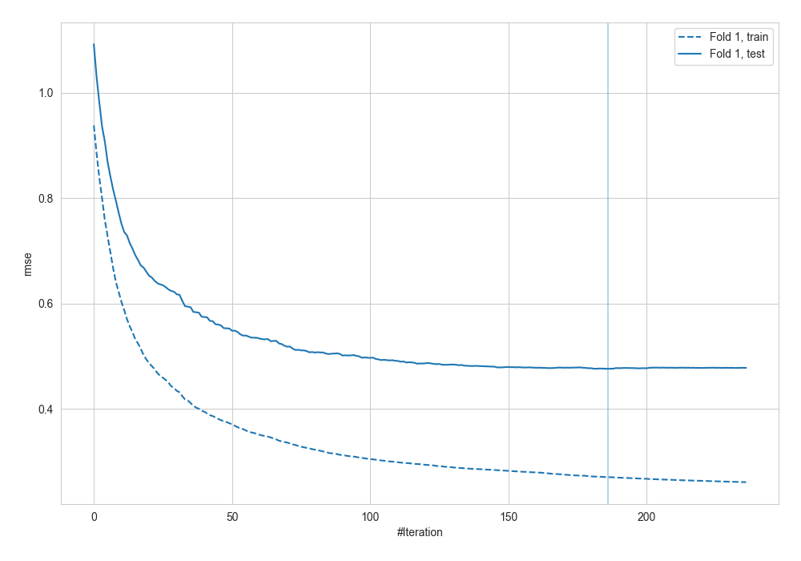
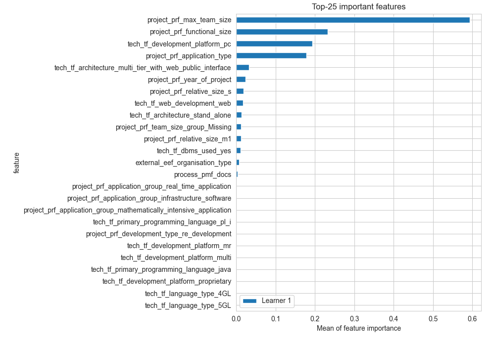
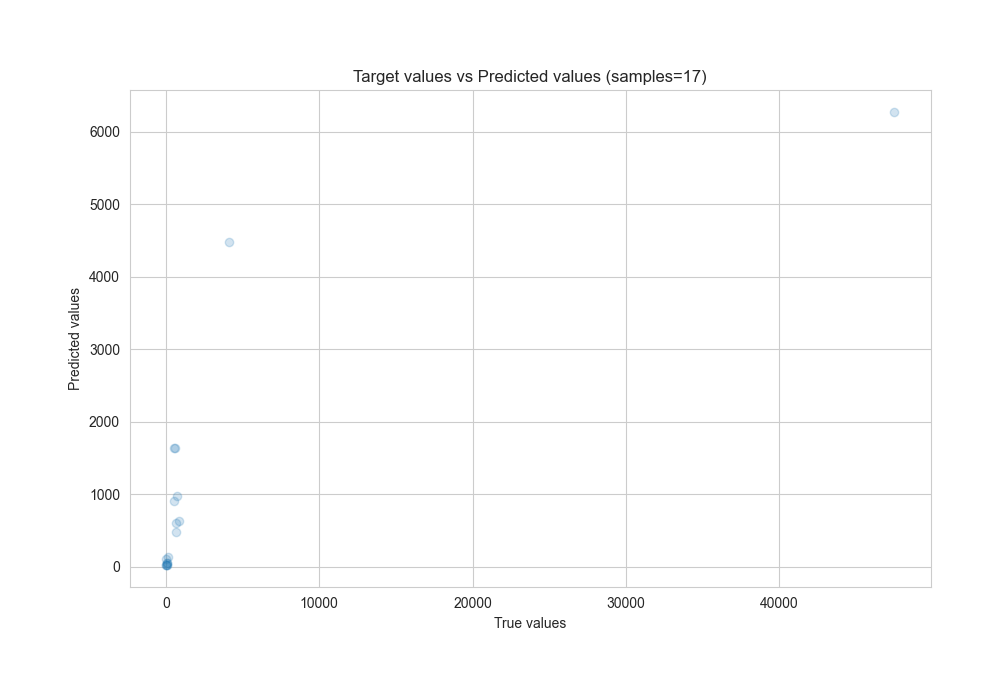
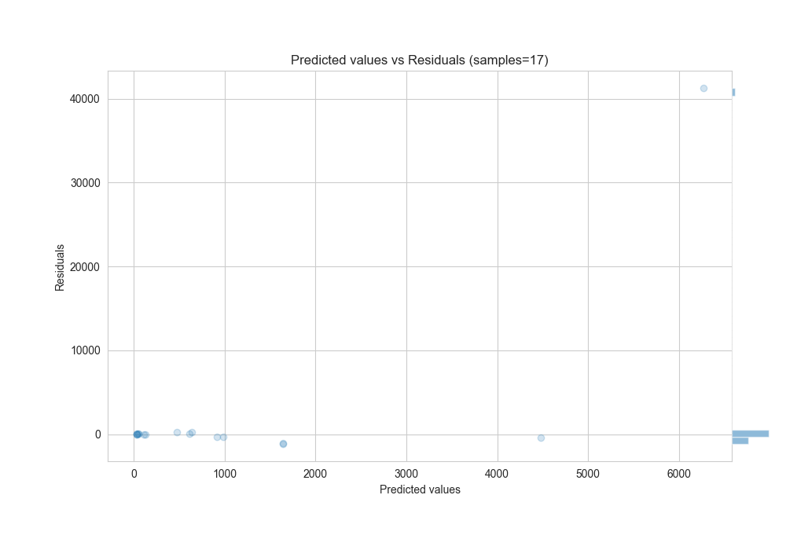

# Summary of 21_LightGBM

[<< Go back](../README.md)

## LightGBM
- **n_jobs**: -1
- **objective**: regression
- **num_leaves**: 15
- **learning_rate**: 0.1
- **feature_fraction**: 0.9
- **bagging_fraction**: 0.8
- **min_data_in_leaf**: 15
- **metric**: rmse
- **custom_eval_metric_name**: None
- **explain_level**: 2

## Validation
 - **validation_type**: split
 - **train_ratio**: 0.8

## Optimized metric
rmse

## Training time

3.3 seconds

### Metric details:
| Metric   |          Score |
|:---------|---------------:|
| MAE      |  2654.02       |
| MSE      |     1.0015e+08 |
| RMSE     | 10007.5        |
| R2       |     0.184229   |
| MAPE     |     0.819306   |

## Learning curves

## Permutation-based Importance

## True vs Predicted

## Predicted vs Residuals

[<< Go back](../README.md)
