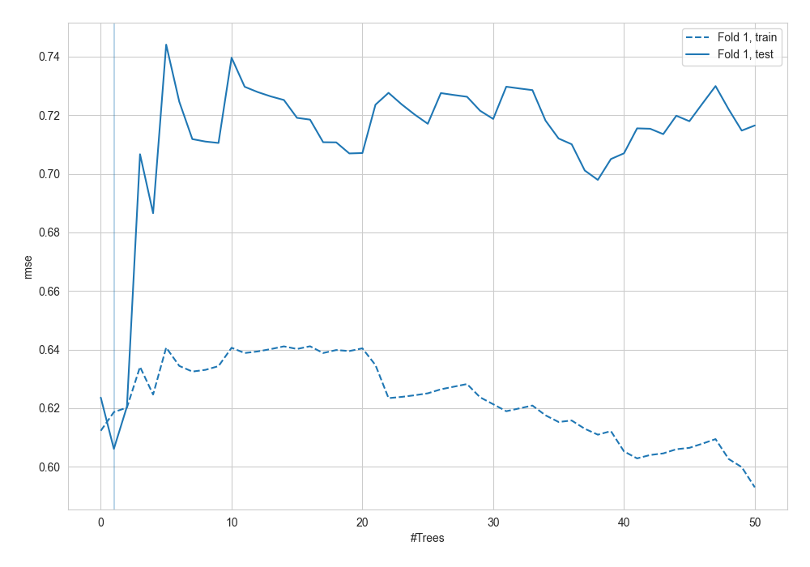
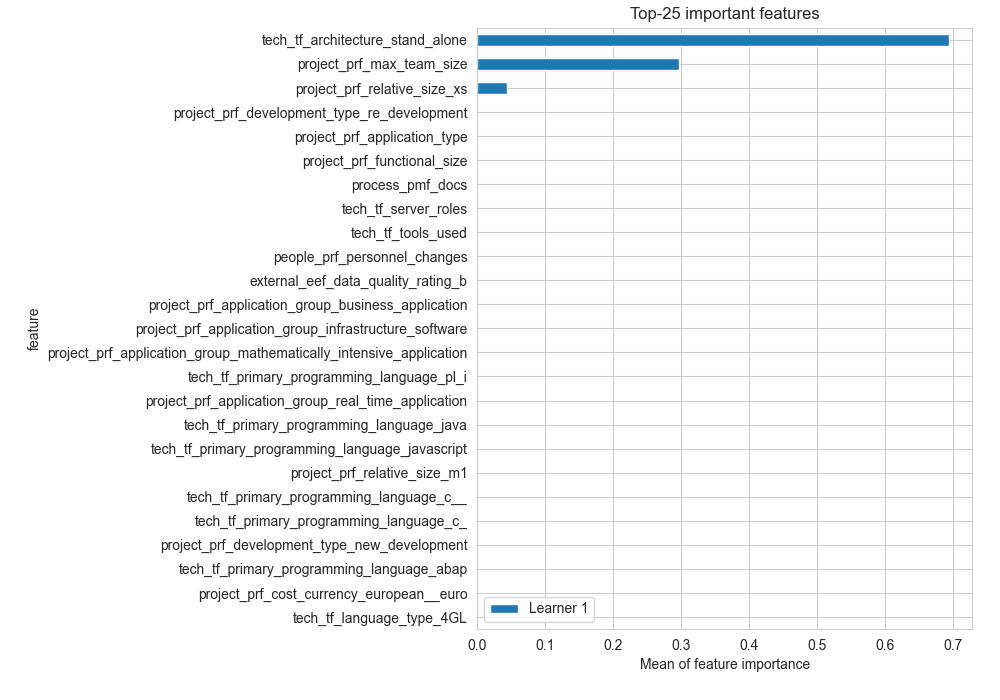
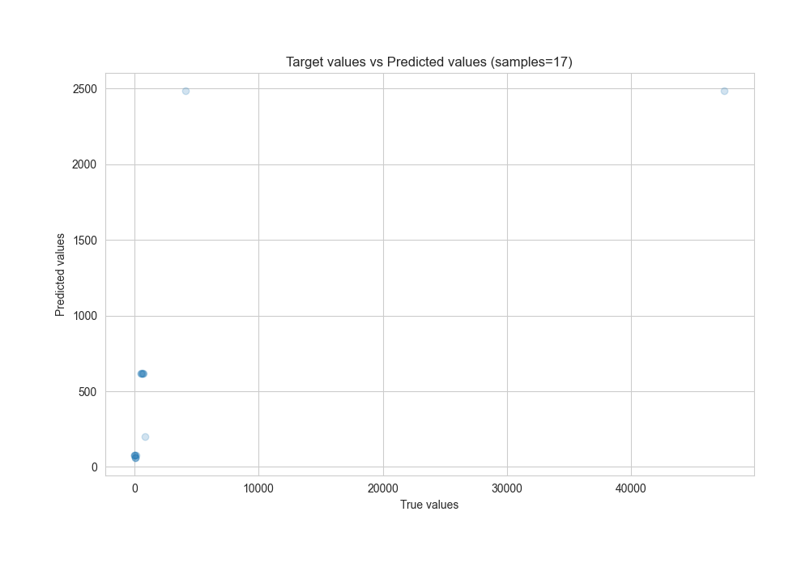
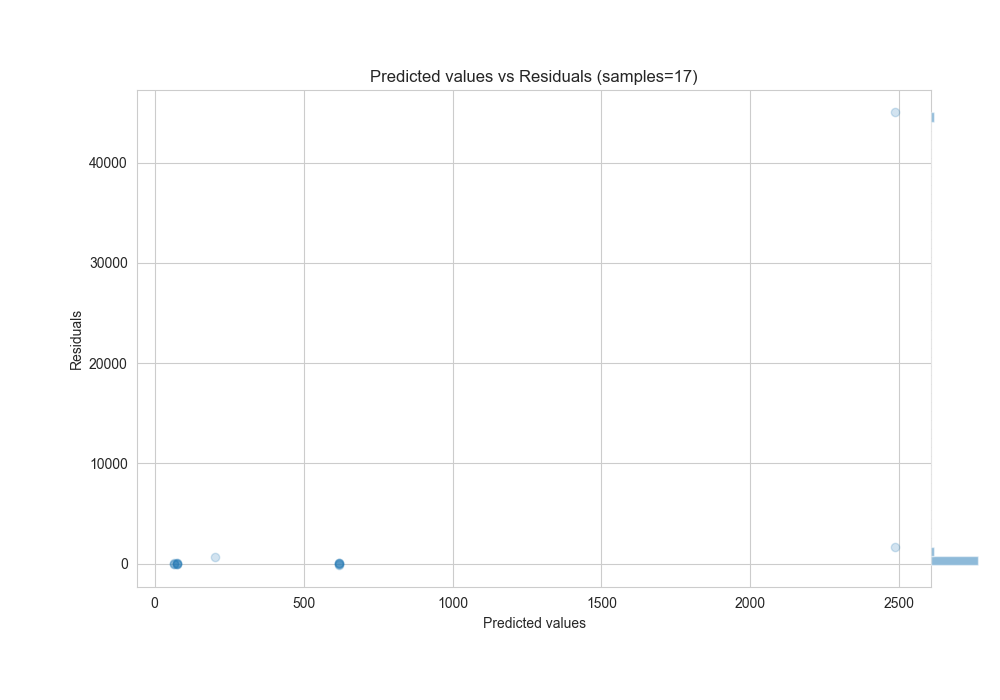
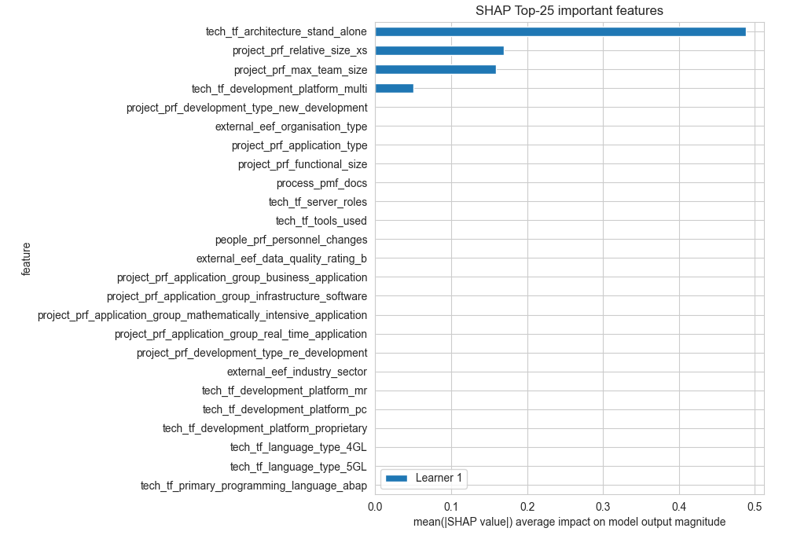
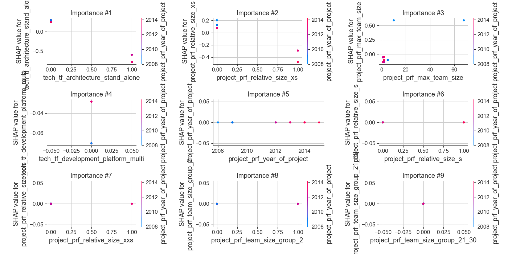
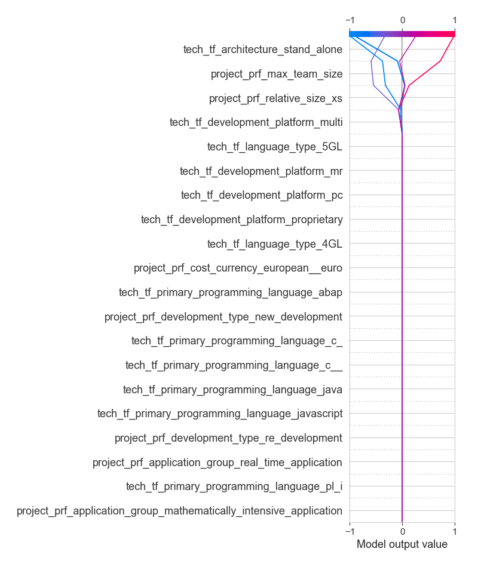
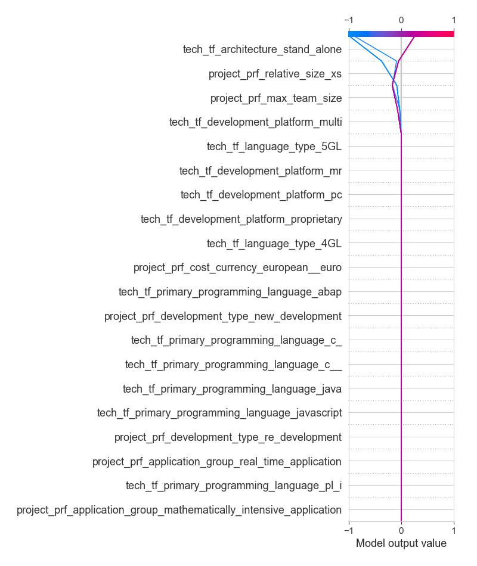

# Summary of 37_ExtraTrees

[<< Go back](../README.md)

## Extra Trees Regressor (Extra Trees)
- **n_jobs**: -1
- **criterion**: squared_error
- **max_features**: 0.5
- **min_samples_split**: 40
- **max_depth**: 7
- **eval_metric_name**: rmse
- **explain_level**: 2

## Validation
 - **validation_type**: split
 - **train_ratio**: 0.8

## Optimized metric
rmse

## Training time

8.9 seconds

### Metric details:
| Metric   |          Score |
|:---------|---------------:|
| MAE      |  2819.32       |
| MSE      |     1.1935e+08 |
| RMSE     | 10924.8        |
| R2       |     0.0278296  |
| MAPE     |     0.901205   |

## Learning curves

## Permutation-based Importance

## True vs Predicted

## Predicted vs Residuals

## SHAP Importance

## SHAP Dependence plots

### Dependence (Fold 1)

## SHAP Decision plots

### Top-10 Worst decisions (Fold 1)

### Top-10 Best decisions (Fold 1)

[<< Go back](../README.md)
