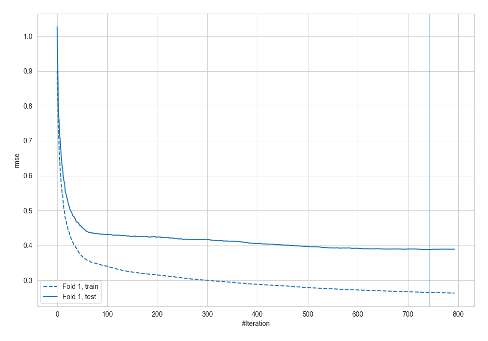
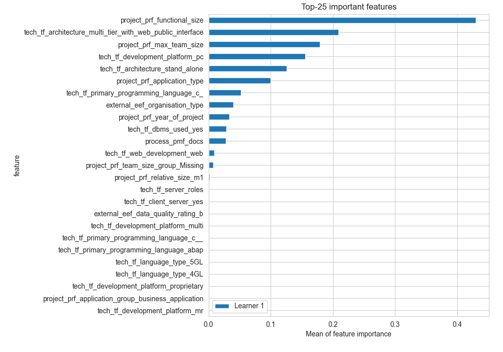
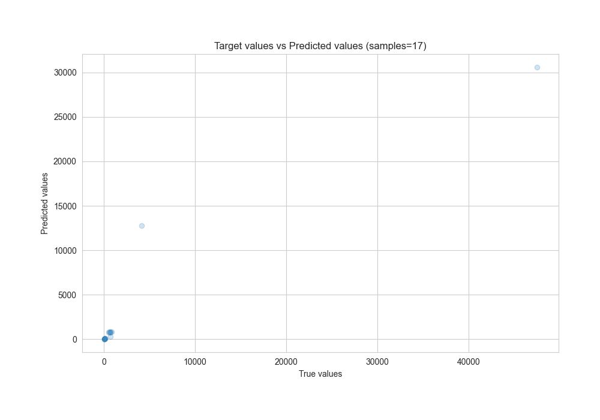
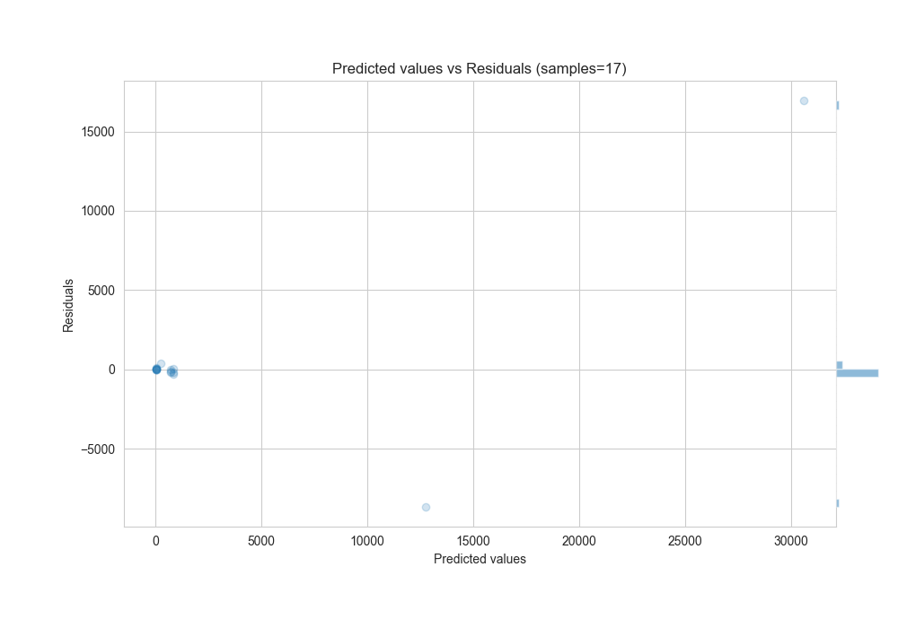

# Summary of 47_LightGBM

[<< Go back](../README.md)

## LightGBM
- **n_jobs**: -1
- **objective**: regression
- **num_leaves**: 95
- **learning_rate**: 0.2
- **feature_fraction**: 0.9
- **bagging_fraction**: 0.8
- **min_data_in_leaf**: 20
- **metric**: rmse
- **custom_eval_metric_name**: None
- **explain_level**: 2

## Validation
 - **validation_type**: split
 - **train_ratio**: 0.8

## Optimized metric
rmse

## Training time

3.8 seconds

### Metric details:
| Metric   |         Score |
|:---------|--------------:|
| MAE      | 1591.1        |
| MSE      |    2.1271e+07 |
| RMSE     | 4612.05       |
| R2       |    0.826737   |
| MAPE     |    0.592132   |

## Learning curves

## Permutation-based Importance

## True vs Predicted

## Predicted vs Residuals

[<< Go back](../README.md)
