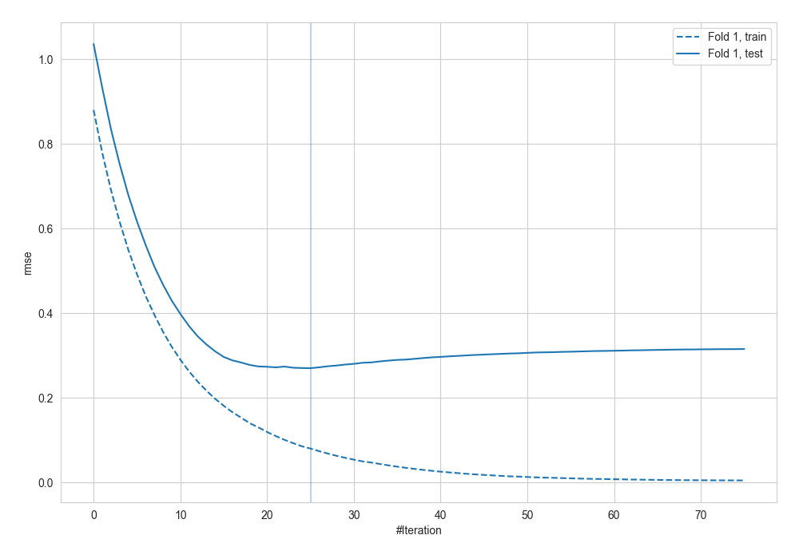
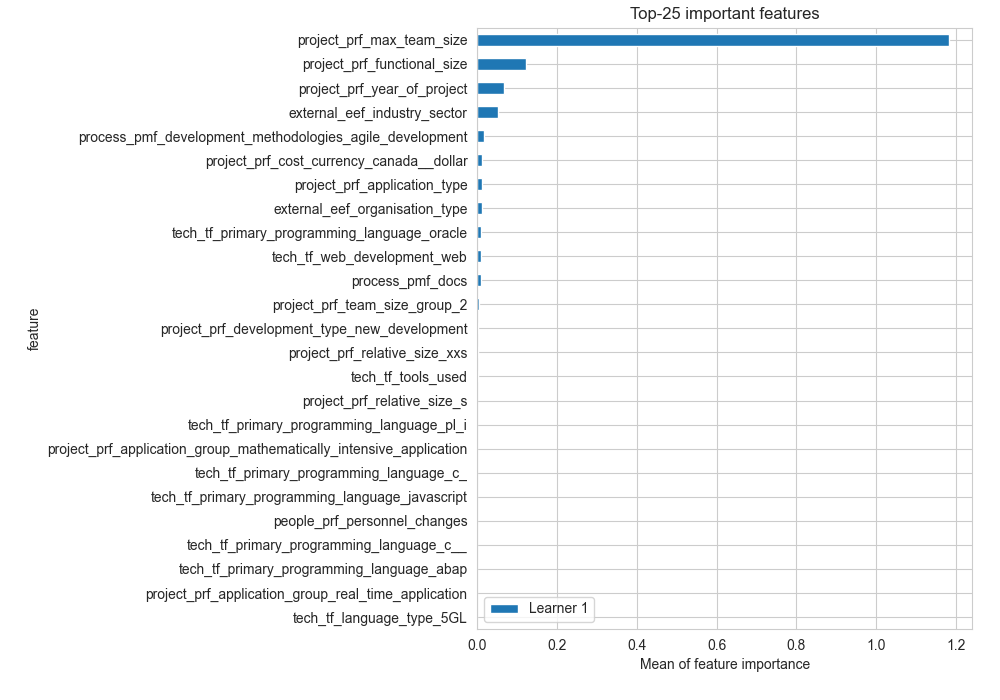
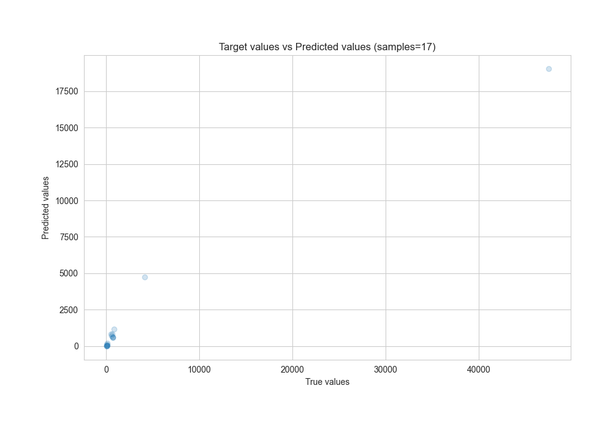
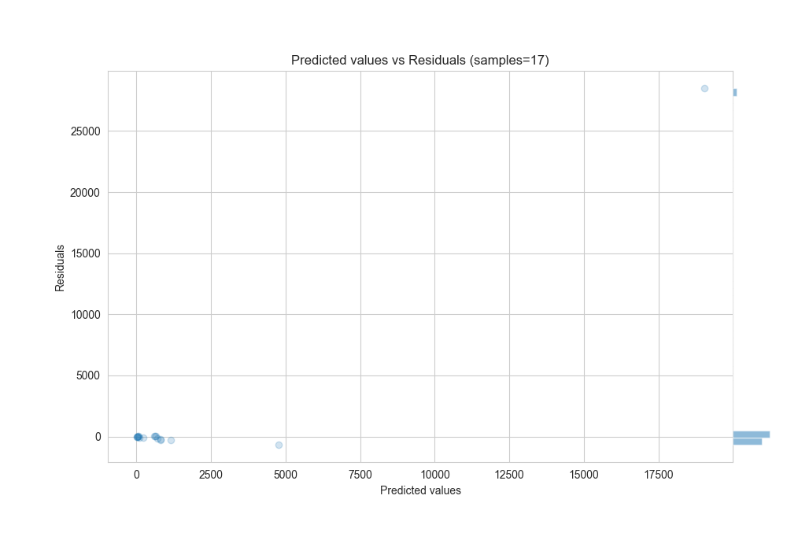

# Summary of 49_Xgboost

[<< Go back](../README.md)

## Extreme Gradient Boosting (Xgboost)
- **n_jobs**: -1
- **objective**: reg:squarederror
- **eta**: 0.15
- **max_depth**: 9
- **min_child_weight**: 1
- **subsample**: 1.0
- **colsample_bytree**: 0.9
- **eval_metric**: rmse
- **explain_level**: 2

## Validation
 - **validation_type**: split
 - **train_ratio**: 0.8

## Optimized metric
rmse

## Training time

3.0 seconds

### Metric details:
| Metric   |          Score |
|:---------|---------------:|
| MAE      | 1795.02        |
| MSE      |    4.77248e+07 |
| RMSE     | 6908.32        |
| R2       |    0.611257    |
| MAPE     |    0.432357    |

## Learning curves

## Permutation-based Importance

## True vs Predicted

## Predicted vs Residuals

[<< Go back](../README.md)
