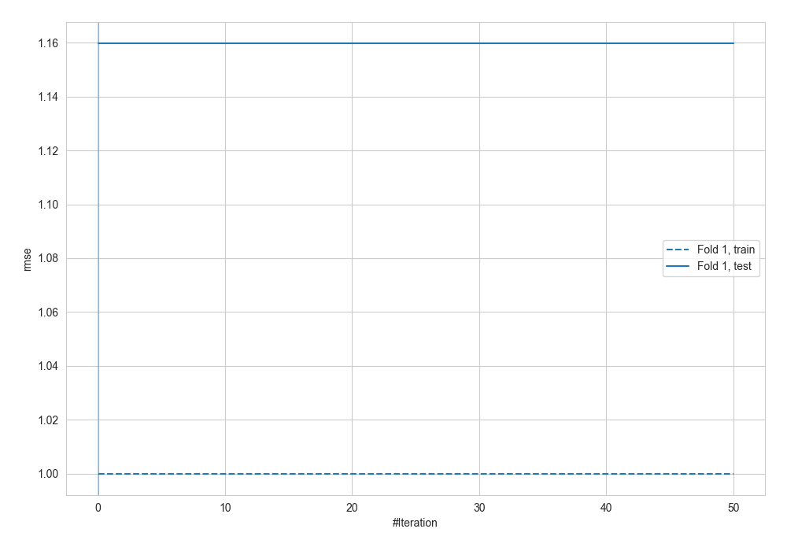
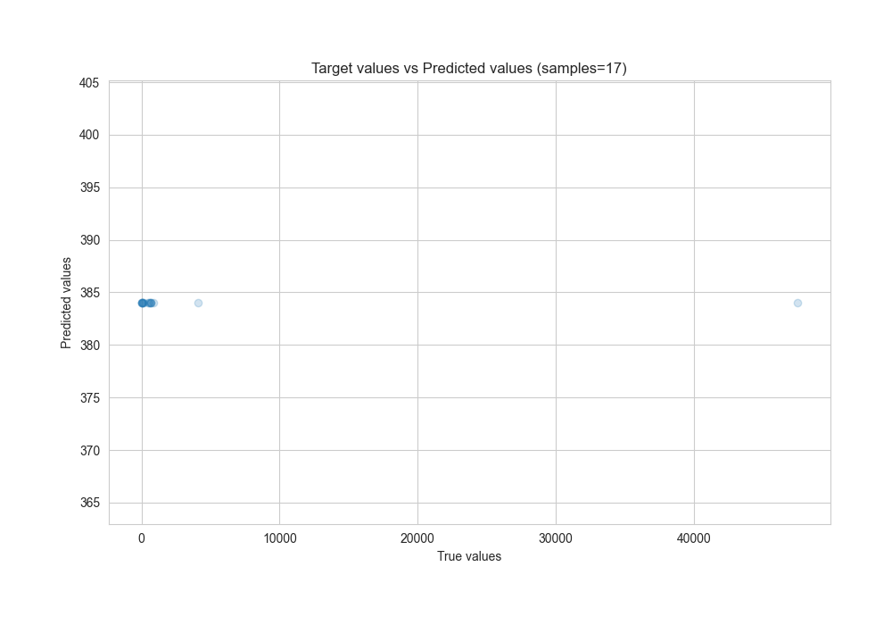
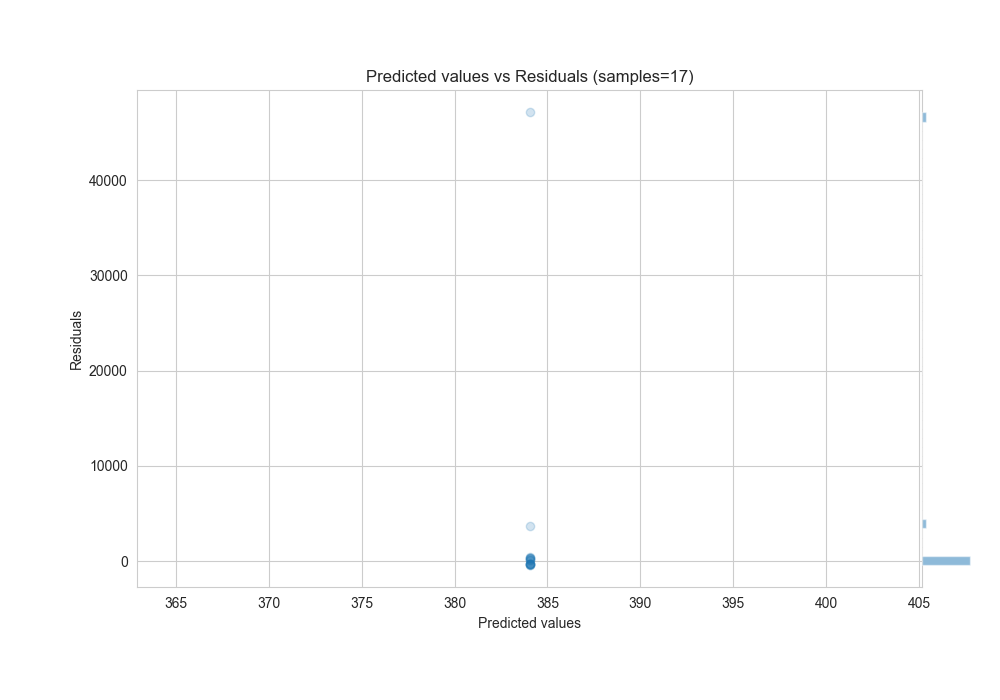

# Summary of 8_Xgboost

[<< Go back](../README.md)

## Extreme Gradient Boosting (Xgboost)
- **n_jobs**: -1
- **objective**: reg:squarederror
- **eta**: 0.05
- **max_depth**: 9
- **min_child_weight**: 50
- **subsample**: 1.0
- **colsample_bytree**: 0.8
- **eval_metric**: rmse
- **explain_level**: 2

## Validation
 - **validation_type**: split
 - **train_ratio**: 0.8

## Optimized metric
rmse

## Training time

3.0 seconds

### Metric details:
| Metric   |           Score |
|:---------|----------------:|
| MAE      |  3254.29        |
| MSE      |     1.31446e+08 |
| RMSE     | 11465           |
| R2       |    -0.0706942   |
| MAPE     |     5.73337     |

## Learning curves

## Permutation-based Importance

## True vs Predicted

## Predicted vs Residuals

[<< Go back](../README.md)
