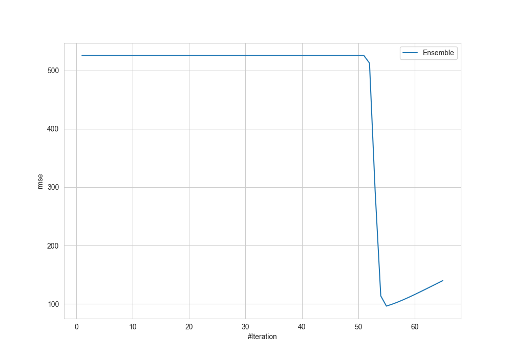
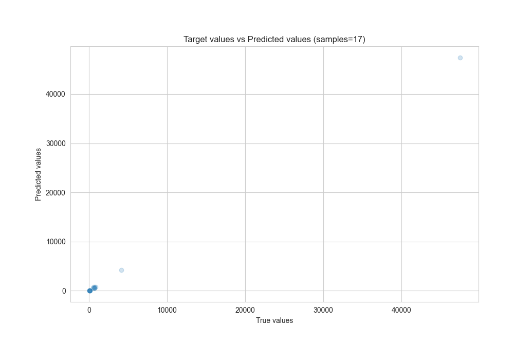
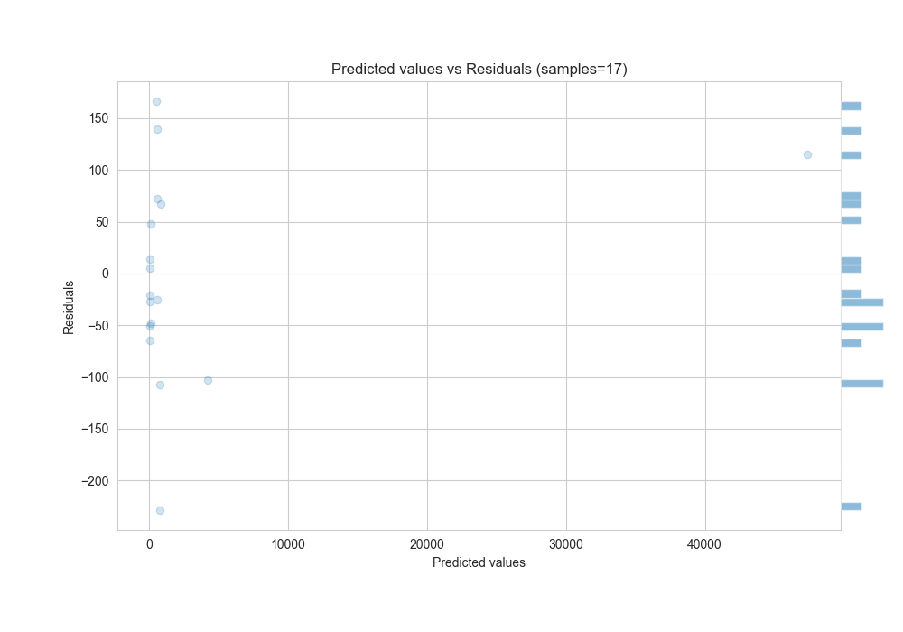

# Summary of Ensemble

[<< Go back](../README.md)

## Ensemble structure
| Model           |   Weight |
|:----------------|---------:|
| 1_Linear        |        1 |
| 29_RandomForest |        2 |
| 35_ExtraTrees   |        1 |
| 36_ExtraTrees   |       51 |

### Metric details:
| Metric   |       Score |
|:---------|------------:|
| MAE      |   76.5888   |
| MSE      | 9263.93     |
| RMSE     |   96.2493   |
| R2       |    0.999925 |
| MAPE     |    0.821896 |

## Learning curves

## True vs Predicted

## Predicted vs Residuals

[<< Go back](../README.md)
