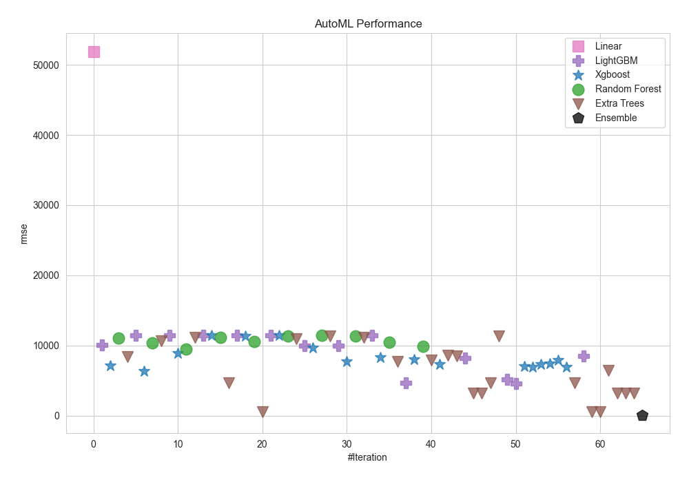
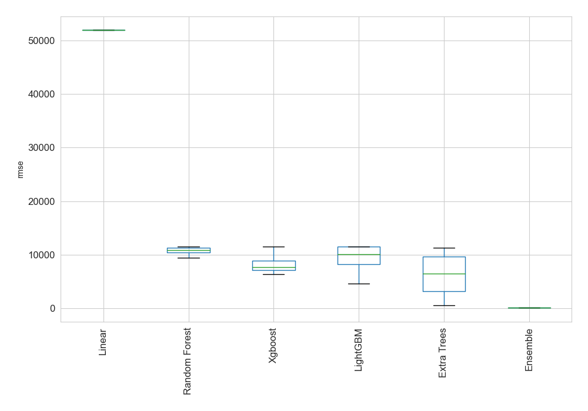
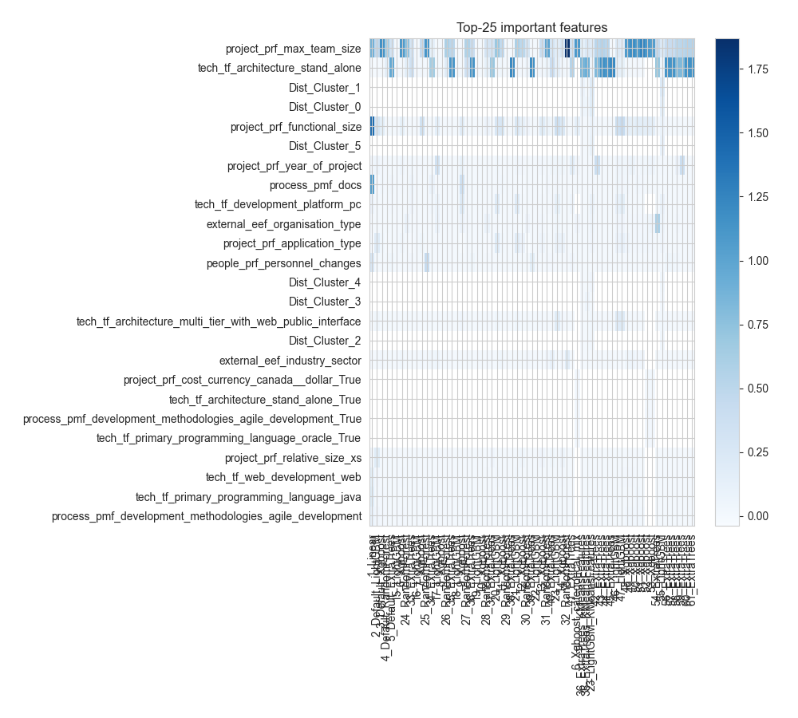
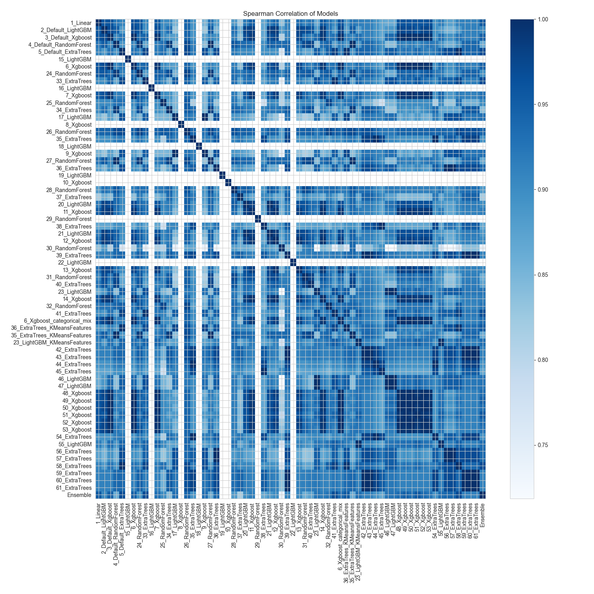

# AutoML Leaderboard

| Best model   | name                                                                   | model_type    | metric_type   |   metric_value |   train_time |
|:-------------|:-----------------------------------------------------------------------|:--------------|:--------------|---------------:|-------------:|
|              | [1_Linear](1_Linear/README.md)                                         | Linear        | rmse          |     51936.1    |        36.14 |
|              | [2_Default_LightGBM](2_Default_LightGBM/README.md)                     | LightGBM      | rmse          |     10108      |         4.51 |
|              | [3_Default_Xgboost](3_Default_Xgboost/README.md)                       | Xgboost       | rmse          |      7104.69   |         3.91 |
|              | [4_Default_RandomForest](4_Default_RandomForest/README.md)             | Random Forest | rmse          |     11039.7    |        11.18 |
|              | [5_Default_ExtraTrees](5_Default_ExtraTrees/README.md)                 | Extra Trees   | rmse          |      8406.55   |        10.87 |
|              | [15_LightGBM](15_LightGBM/README.md)                                   | LightGBM      | rmse          |     11465      |         3.46 |
|              | [6_Xgboost](6_Xgboost/README.md)                                       | Xgboost       | rmse          |      6337.25   |         4.05 |
|              | [24_RandomForest](24_RandomForest/README.md)                           | Random Forest | rmse          |     10389.3    |        11.63 |
|              | [33_ExtraTrees](33_ExtraTrees/README.md)                               | Extra Trees   | rmse          |     10688.2    |        15.38 |
|              | [16_LightGBM](16_LightGBM/README.md)                                   | LightGBM      | rmse          |     11465      |         3.55 |
|              | [7_Xgboost](7_Xgboost/README.md)                                       | Xgboost       | rmse          |      8856.23   |         4.85 |
|              | [25_RandomForest](25_RandomForest/README.md)                           | Random Forest | rmse          |      9473.7    |         9.78 |
|              | [34_ExtraTrees](34_ExtraTrees/README.md)                               | Extra Trees   | rmse          |     11106.7    |        10.44 |
|              | [17_LightGBM](17_LightGBM/README.md)                                   | LightGBM      | rmse          |     11412.5    |         3.91 |
|              | [8_Xgboost](8_Xgboost/README.md)                                       | Xgboost       | rmse          |     11465      |         4.46 |
|              | [26_RandomForest](26_RandomForest/README.md)                           | Random Forest | rmse          |     11137.3    |         9.69 |
|              | [35_ExtraTrees](35_ExtraTrees/README.md)                               | Extra Trees   | rmse          |      4673.07   |        11.33 |
|              | [18_LightGBM](18_LightGBM/README.md)                                   | LightGBM      | rmse          |     11465      |         4.07 |
|              | [9_Xgboost](9_Xgboost/README.md)                                       | Xgboost       | rmse          |     11368.6    |         5.03 |
|              | [27_RandomForest](27_RandomForest/README.md)                           | Random Forest | rmse          |     10604.8    |         9.5  |
|              | [36_ExtraTrees](36_ExtraTrees/README.md)                               | Extra Trees   | rmse          |       525.656  |        10.94 |
|              | [19_LightGBM](19_LightGBM/README.md)                                   | LightGBM      | rmse          |     11465      |         3.55 |
|              | [10_Xgboost](10_Xgboost/README.md)                                     | Xgboost       | rmse          |     11465      |         4.21 |
|              | [28_RandomForest](28_RandomForest/README.md)                           | Random Forest | rmse          |     11312.1    |        10.58 |
|              | [37_ExtraTrees](37_ExtraTrees/README.md)                               | Extra Trees   | rmse          |     10924.8    |        10.83 |
|              | [20_LightGBM](20_LightGBM/README.md)                                   | LightGBM      | rmse          |      9961.14   |         3.92 |
|              | [11_Xgboost](11_Xgboost/README.md)                                     | Xgboost       | rmse          |      9628.93   |         4.72 |
|              | [29_RandomForest](29_RandomForest/README.md)                           | Random Forest | rmse          |     11470.8    |        10.86 |
|              | [38_ExtraTrees](38_ExtraTrees/README.md)                               | Extra Trees   | rmse          |     11321.1    |        10.86 |
|              | [21_LightGBM](21_LightGBM/README.md)                                   | LightGBM      | rmse          |     10007.5    |         4.57 |
|              | [12_Xgboost](12_Xgboost/README.md)                                     | Xgboost       | rmse          |      7714.02   |         4.95 |
|              | [30_RandomForest](30_RandomForest/README.md)                           | Random Forest | rmse          |     11371.7    |        11.91 |
|              | [39_ExtraTrees](39_ExtraTrees/README.md)                               | Extra Trees   | rmse          |     11103.7    |        10.08 |
|              | [22_LightGBM](22_LightGBM/README.md)                                   | LightGBM      | rmse          |     11465      |         3.74 |
|              | [13_Xgboost](13_Xgboost/README.md)                                     | Xgboost       | rmse          |      8313.98   |         4.63 |
|              | [31_RandomForest](31_RandomForest/README.md)                           | Random Forest | rmse          |     10412.3    |        11.28 |
|              | [40_ExtraTrees](40_ExtraTrees/README.md)                               | Extra Trees   | rmse          |      7669.75   |         9.91 |
|              | [23_LightGBM](23_LightGBM/README.md)                                   | LightGBM      | rmse          |      4701.54   |         6.12 |
|              | [14_Xgboost](14_Xgboost/README.md)                                     | Xgboost       | rmse          |      8014.39   |         5.43 |
|              | [32_RandomForest](32_RandomForest/README.md)                           | Random Forest | rmse          |      9855.15   |        11.23 |
|              | [41_ExtraTrees](41_ExtraTrees/README.md)                               | Extra Trees   | rmse          |      7880.61   |        10.04 |
|              | [6_Xgboost_categorical_mix](6_Xgboost_categorical_mix/README.md)       | Xgboost       | rmse          |      7365.33   |         3.77 |
|              | [36_ExtraTrees_KMeansFeatures](36_ExtraTrees_KMeansFeatures/README.md) | Extra Trees   | rmse          |      8605.48   |        19.05 |
|              | [35_ExtraTrees_KMeansFeatures](35_ExtraTrees_KMeansFeatures/README.md) | Extra Trees   | rmse          |      8541.39   |        11.74 |
|              | [23_LightGBM_KMeansFeatures](23_LightGBM_KMeansFeatures/README.md)     | LightGBM      | rmse          |      8187.93   |         7.86 |
|              | [42_ExtraTrees](42_ExtraTrees/README.md)                               | Extra Trees   | rmse          |      3228.04   |        10.58 |
|              | [43_ExtraTrees](43_ExtraTrees/README.md)                               | Extra Trees   | rmse          |      3228.04   |        11.25 |
|              | [44_ExtraTrees](44_ExtraTrees/README.md)                               | Extra Trees   | rmse          |      4673.07   |        11.01 |
|              | [45_ExtraTrees](45_ExtraTrees/README.md)                               | Extra Trees   | rmse          |     11321.1    |         9.59 |
|              | [46_LightGBM](46_LightGBM/README.md)                                   | LightGBM      | rmse          |      5179.35   |         9.06 |
|              | [47_LightGBM](47_LightGBM/README.md)                                   | LightGBM      | rmse          |      4612.05   |         4.99 |
|              | [48_Xgboost](48_Xgboost/README.md)                                     | Xgboost       | rmse          |      6982.04   |         4.52 |
|              | [49_Xgboost](49_Xgboost/README.md)                                     | Xgboost       | rmse          |      6908.32   |         4.15 |
|              | [50_Xgboost](50_Xgboost/README.md)                                     | Xgboost       | rmse          |      7338.78   |         4.15 |
|              | [51_Xgboost](51_Xgboost/README.md)                                     | Xgboost       | rmse          |      7413.05   |         4.78 |
|              | [52_Xgboost](52_Xgboost/README.md)                                     | Xgboost       | rmse          |      7944.45   |         3.97 |
|              | [53_Xgboost](53_Xgboost/README.md)                                     | Xgboost       | rmse          |      6969.61   |         3.89 |
|              | [54_ExtraTrees](54_ExtraTrees/README.md)                               | Extra Trees   | rmse          |      4664.95   |        10.81 |
|              | [55_LightGBM](55_LightGBM/README.md)                                   | LightGBM      | rmse          |      8449.61   |        18.87 |
|              | [56_ExtraTrees](56_ExtraTrees/README.md)                               | Extra Trees   | rmse          |       525.656  |        10.13 |
|              | [57_ExtraTrees](57_ExtraTrees/README.md)                               | Extra Trees   | rmse          |       525.656  |        10.23 |
|              | [58_ExtraTrees](58_ExtraTrees/README.md)                               | Extra Trees   | rmse          |      6415.81   |        10.78 |
|              | [59_ExtraTrees](59_ExtraTrees/README.md)                               | Extra Trees   | rmse          |      3228.04   |         9.74 |
|              | [60_ExtraTrees](60_ExtraTrees/README.md)                               | Extra Trees   | rmse          |      3228.04   |         9.55 |
|              | [61_ExtraTrees](61_ExtraTrees/README.md)                               | Extra Trees   | rmse          |      3228.04   |         9.97 |
| **the best** | [Ensemble](Ensemble/README.md)                                         | Ensemble      | rmse          |        96.2493 |        13.12 |

### AutoML Performance

### AutoML Performance Boxplot

### Features Importance

### Spearman Correlation of Models

