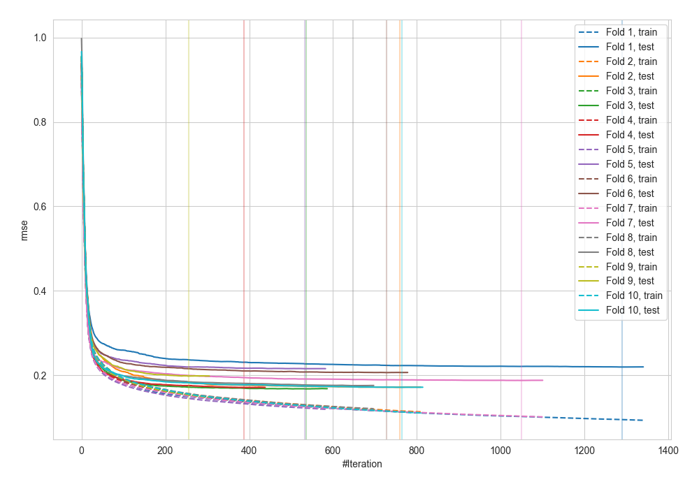

# Summary of 12_LightGBM

[<< Go back](../README.md)

## LightGBM
- **n_jobs**: -1
- **objective**: regression
- **num_leaves**: 15
- **learning_rate**: 0.1
- **feature_fraction**: 0.8
- **bagging_fraction**: 0.9
- **min_data_in_leaf**: 50
- **metric**: rmse
- **custom_eval_metric_name**: None
- **explain_level**: 2

## Validation
 - **validation_type**: kfold
 - **k_folds**: 10

## Optimized metric
rmse

## Training time

83.4 seconds

### Metric details:
| Metric   |          Score |
|:---------|---------------:|
| MAE      |  873.218       |
| MSE      |    2.93278e+07 |
| RMSE     | 5415.52        |
| R2       |    0.711126    |
| MAPE     |    0.153998    |

## Learning curves

## Permutation-based Importance

## True vs Predicted

## Predicted vs Residuals

[<< Go back](../README.md)
