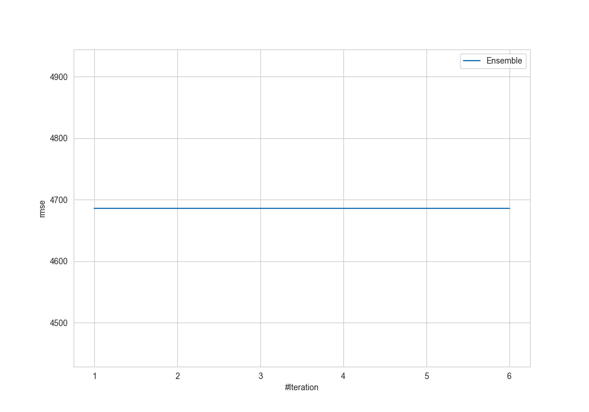
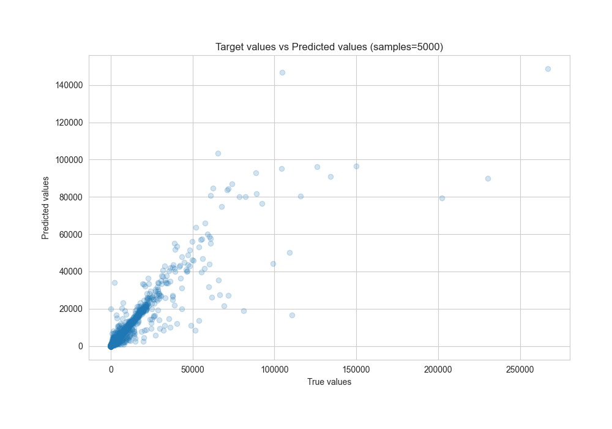
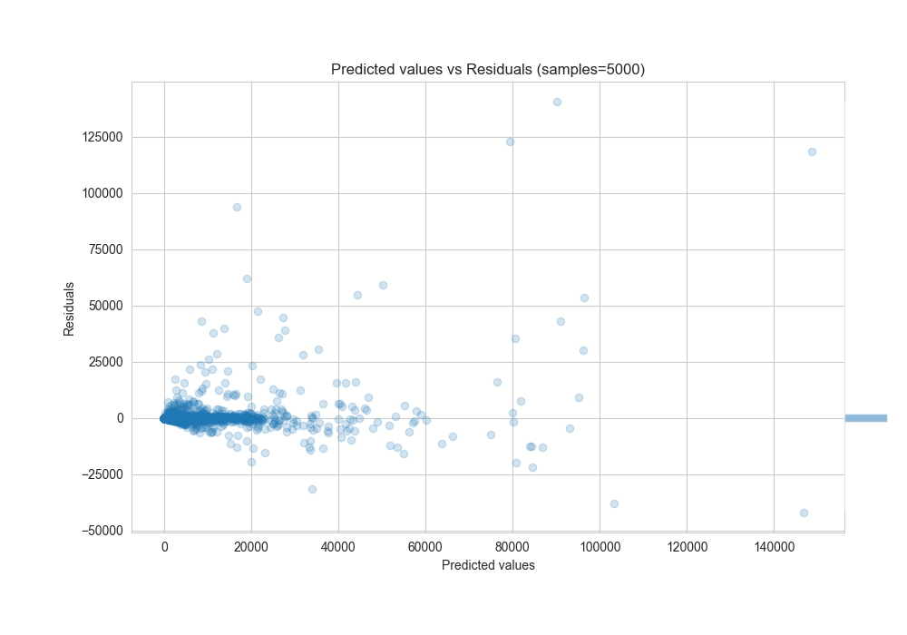

# Summary of Ensemble

[<< Go back](../README.md)

## Ensemble structure
| Model              |   Weight |
|:-------------------|---------:|
| 2_Default_LightGBM |        1 |

### Metric details:
| Metric   |          Score |
|:---------|---------------:|
| MAE      |  715.643       |
| MSE      |    2.19632e+07 |
| RMSE     | 4686.49        |
| R2       |    0.783667    |
| MAPE     |    0.135748    |

## Learning curves

## True vs Predicted

## Predicted vs Residuals

[<< Go back](../README.md)
