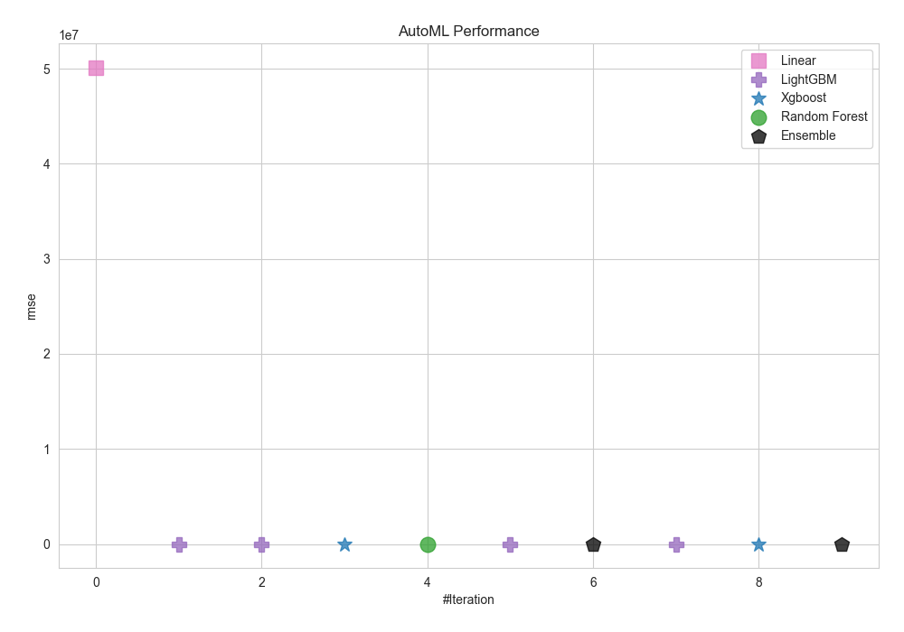
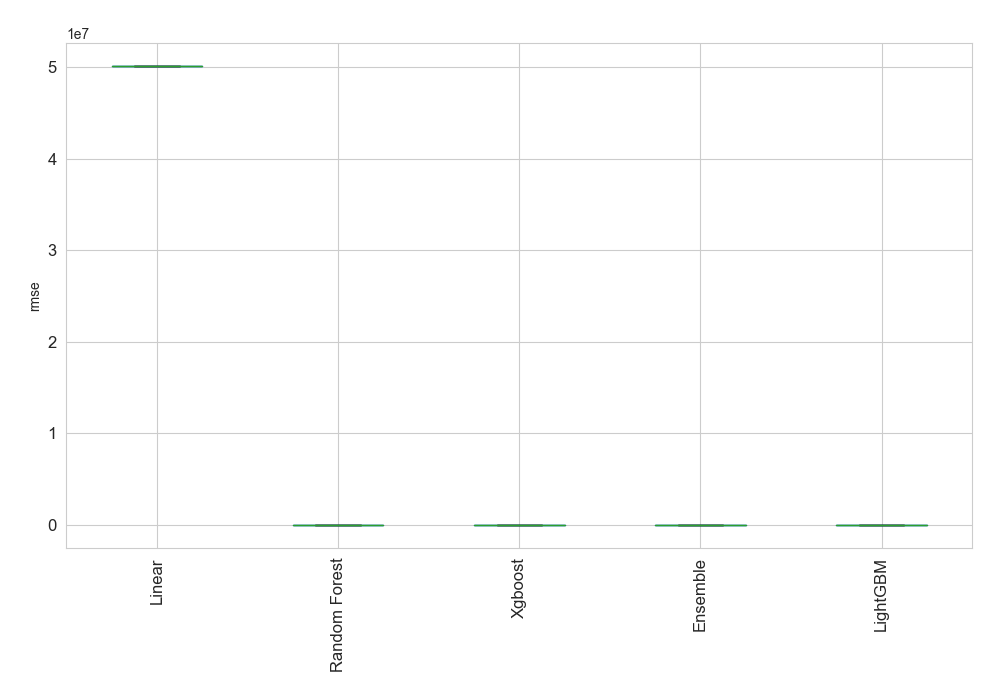
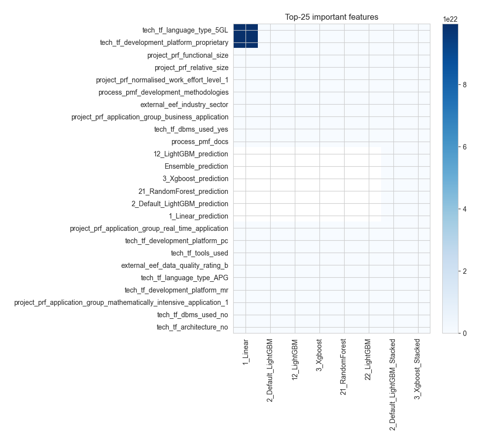
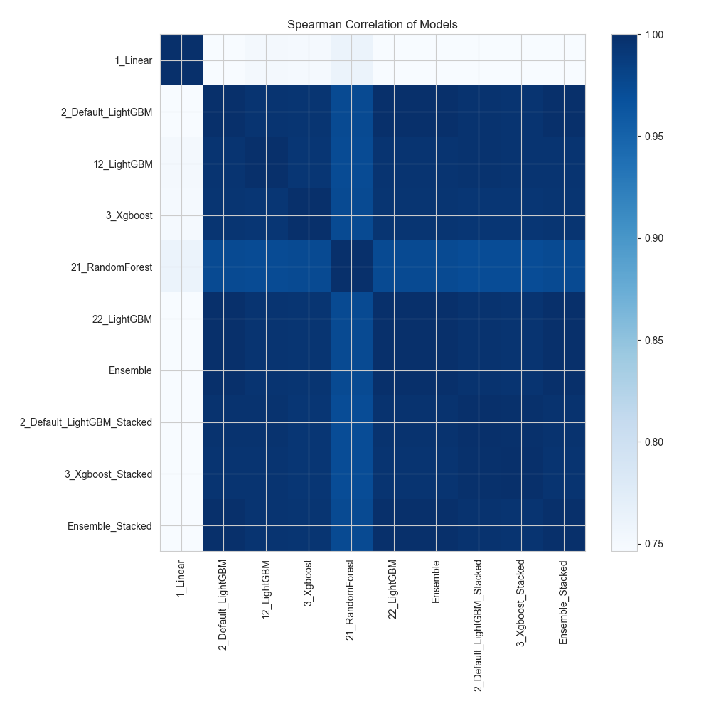

# AutoML Leaderboard

| Best model   | name                                                               | model_type    | metric_type   |   metric_value |   train_time |
|:-------------|:-------------------------------------------------------------------|:--------------|:--------------|---------------:|-------------:|
|              | [1_Linear](1_Linear/README.md)                                     | Linear        | rmse          |    5.01486e+07 |        76.65 |
| **the best** | [2_Default_LightGBM](2_Default_LightGBM/README.md)                 | LightGBM      | rmse          | 4686.49        |       109.07 |
|              | [12_LightGBM](12_LightGBM/README.md)                               | LightGBM      | rmse          | 5415.52        |        85.17 |
|              | [3_Xgboost](3_Xgboost/README.md)                                   | Xgboost       | rmse          | 5493.79        |        40.9  |
|              | [21_RandomForest](21_RandomForest/README.md)                       | Random Forest | rmse          | 7415.69        |        98.38 |
|              | [22_LightGBM](22_LightGBM/README.md)                               | LightGBM      | rmse          | 4686.49        |       111.53 |
|              | [Ensemble](Ensemble/README.md)                                     | Ensemble      | rmse          | 4686.49        |         0.31 |
|              | [2_Default_LightGBM_Stacked](2_Default_LightGBM_Stacked/README.md) | LightGBM      | rmse          | 5118.17        |        40.69 |
|              | [3_Xgboost_Stacked](3_Xgboost_Stacked/README.md)                   | Xgboost       | rmse          | 5400.85        |        33.39 |
|              | [Ensemble_Stacked](Ensemble_Stacked/README.md)                     | Ensemble      | rmse          | 4686.49        |         0.39 |

### AutoML Performance

### AutoML Performance Boxplot

### Features Importance

### Spearman Correlation of Models

